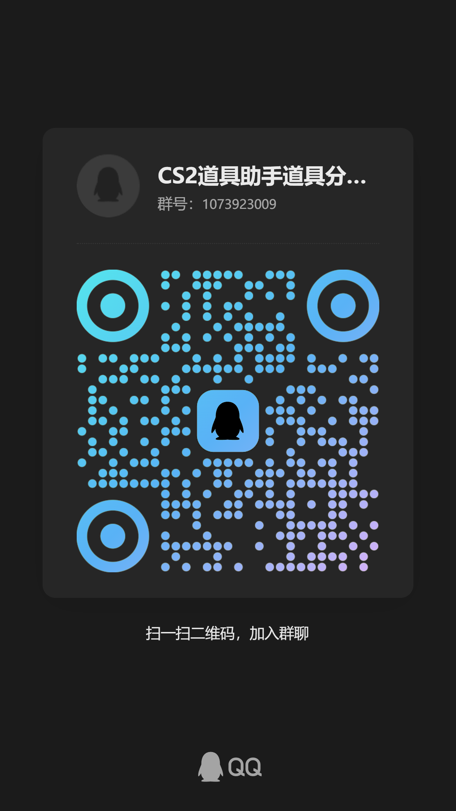

# Grenade Helper 道具包分享仓库

这是一个社区驱动的 CS2 道具包索引仓库。本仓库仅存储道具包的 **JSON 索引文件**，因为道具包的体积普遍庞大，所以实际的道具包文件存储在 Cloudflare R2 对象存储中。

## 📦 存储架构

```
GitHub 仓库 (本仓库)          Cloudflare R2 (文件存储)
├── index.json               ├── xxx.cs2pkg
├── packages/                ├── yyy.cs2pkg
│   ├── dust2/*.json    →    └── zzz.cs2pkg
│   ├── inferno/*.json
│   └── ...
```

- **GitHub**：存储 JSON 索引，记录道具包信息和下载链接
- **Cloudflare R2**：存储实际的 `.cs2pkg` 道具包文件

## 🎮 如何分享你的道具包

1. **加入官方 QQ 群**：1073923009
   **或者扫码添加**:
   <div>
   
   </div>
2. **在群内分享你的道具包文件** (`.cs2pkg`)以及对应的json索引文件(.json)，格式可参考下面的示例
3. **等待审核**：管理员审核后会上传到 R2 存储并更新索引

## 📄 JSON 文件格式（仅供参考）

```json
{
  "author": "你的名字",
  "packages": [
    {
      "id": "your_name_dust2_v1",
      "name": "Dust2 烟雾合集",
      "description": "我常用的烟点",
      "version": "1.0.0",
      "updated": "2025-12-24",
      "url": '注：此段不需要分享者填写'
    }
  ]
}
```

## 📋 JSON 字段说明

| 字段          | 类型        | 必填 | 说明                                     |
| ------------- | ----------- | ---- | ---------------------------------------- |
| `id`          | string      | ✅    | 唯一标识符，建议格式: `作者名_地图_版本` |
| `name`        | string      | ✅    | 显示名称                                 |
| `description` | string      | ❌    | 描述信息                                 |
| `map`         | string/null | ❌    | 地图名（地图文件夹中自动设置）           |
| `version`     | string      | ✅    | 版本号，如 "1.0.0"（用于检测更新）       |
| `updated`     | string      | ❌    | 更新日期 (YYYY-MM-DD)                    |
| `url`         | string      | ✅    | R2 存储的完整下载 URL                    |


## ❓ 常见问题

**Q: 为什么道具包不直接存储在 GitHub？**

A: GitHub 对单个文件有 100MB 的限制，且 Git LFS 有带宽限制。使用 R2 存储可以：
- 存储任意大小的文件
- 无下载流量限制
- 配合 CDN 加速，国内下载更快

**Q: 我的道具包多久会上架？**

A: 通常在提交后 48 小时内审核完成。

## 📜 许可证

MIT License
